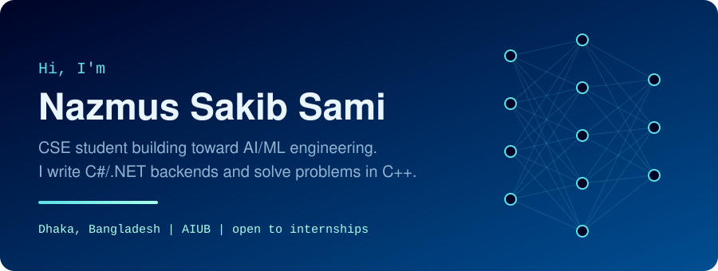
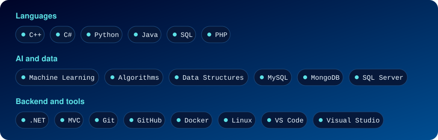
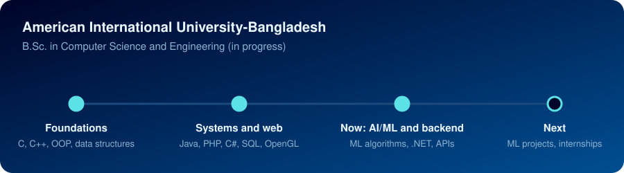

  

  

 

  

 

  
  

 

---

<h2 align="center">👋 About Me</h2>

I'm a Computer Science and Engineering student aiming to become an <b>AI / Machine Learning Engineer</b>. 
I build <b>backend systems</b> in C# and .NET, and sharpen my thinking with <b>algorithms and competitive programming</b>. 
My goal is to combine solid software engineering with AI to ship useful, efficient products.

---

<h2 align="center">🛠️ Technical Arsenal</h2>

  

  

---

<h2 align="center">💻 Projects</h2>

  

  <a href="https://github.com/dnsakibss/HOTEL-MANAGEMENT-SYSTEM"><b>Hotel Management</b></a>&nbsp;&nbsp;|&nbsp;&nbsp;
  <a href="https://github.com/dnsakibss/Project-Simulator"><b>Project Simulator</b></a>&nbsp;&nbsp;|&nbsp;&nbsp;
  <a href="https://github.com/dnsakibss/4_SCENE_OF_TRANSPORTATION_ENVIRONMENT_COMPUTER_GRAPHICS"><b>4-Scene Transportation</b></a>&nbsp;&nbsp;|&nbsp;&nbsp;
  <a href="https://github.com/dnsakibss/LIBRARY-MANAGEMENT-SYSTEM-Web_Tech_Project"><b>Library Management</b></a>&nbsp;&nbsp;|&nbsp;&nbsp;
  <a href="https://github.com/dnsakibss/CivicLens"><b>CivicLens</b></a>&nbsp;&nbsp;|&nbsp;&nbsp;
  <a href="https://github.com/dnsakibss/CivicLens2.0"><b>CivicLens 2.0</b></a>&nbsp;&nbsp;|&nbsp;&nbsp;
  <a href="https://github.com/dnsakibss/wearable-fatigue-detection"><b>Wearable Fatigue Detection</b></a>

---

<h2 align="center">🎓 Academic Journey</h2>

  

---

<h2 align="center">🐍 Contribution Snake</h2>

  

---

<h2 align="center">📊 GitHub Activity</h2>

  
  
    
  
  
    
   

 

  

  

